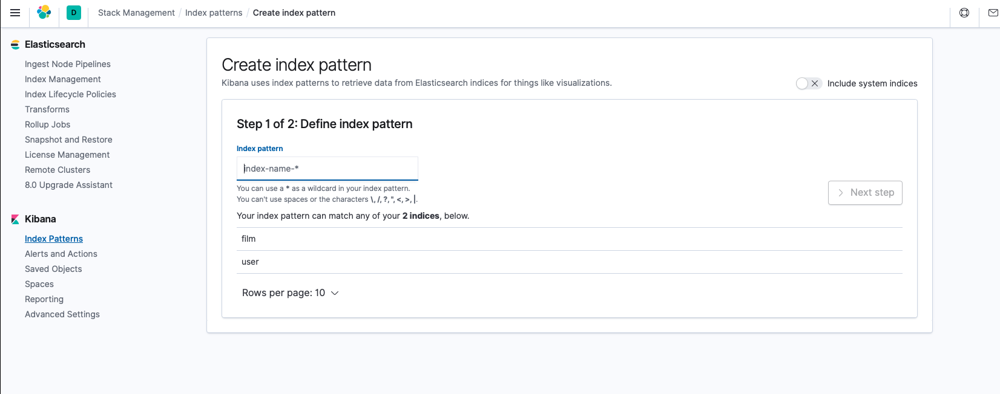
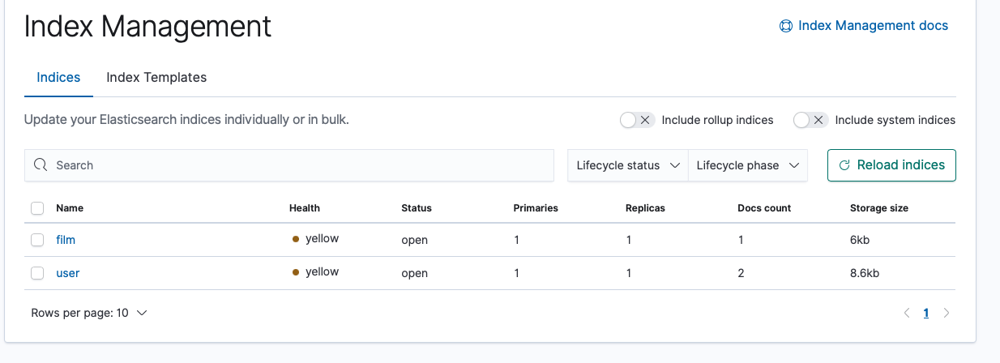
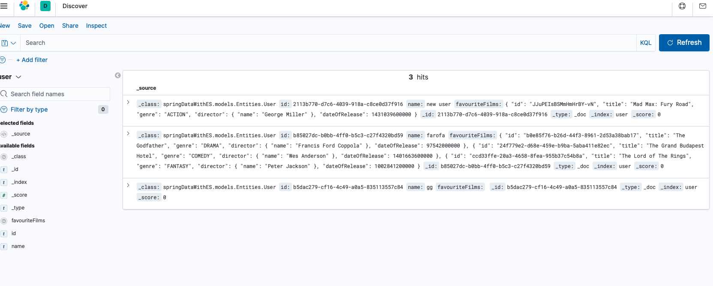
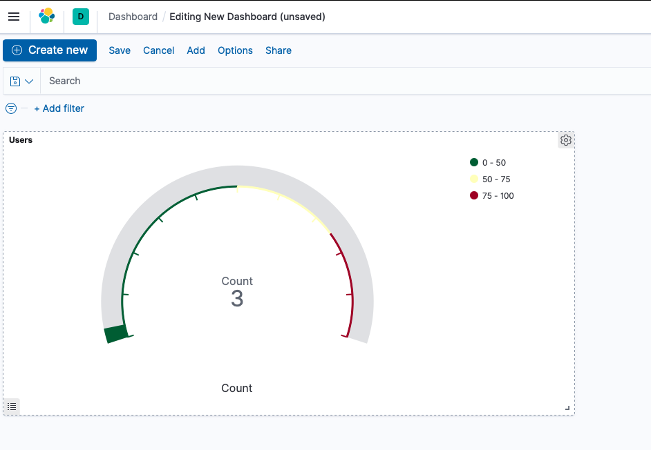

# Spring Data with ElasticSearch using Kibana

## Overview

SpringBoot application using Spring Data with Elastic Search. Simply, represents CRUD operations with groups of users with favourite films (which in itself contains a user as a director).


## Tech Analysis

High level application architecture is represented with three major layers to promote decoupling: Presentation, Service and Persistence.

<b>Client <-> Controllers <-DTO-> Services <-Entities-> Persistence</b>   

To keep separation of responsability, different models are used when in response to client and accessing the repositories. 

Added the dependency for Spring Data with ES
```
<dependency>
  <groupId>org.springframework.data</groupId>
  <artifactId>spring-data-elasticsearch</artifactId>
  <version>${spring.data.version}</version>
</dependency>
```

The Data is defined using Spring Data, defining the index in the class name and identifying the id with proper annotation.

```
@Document(indexName = "film")
public class Film {
    @Id
    private String id;
```

Custom queries are used to illustrate querying with Elastic Search. As an example, finding an user by name: ```@Query("{\"bool\": {\"must\": [{\"match\": {\"name\": \"?0\"}}]}}")```


## API Usage

First start dependencies (like Elastic Search) using docker. On the project base dir:
```docker-compose up```

#### Create User with Non-Existent Film
Request:
POST:http://localhost:8085/bmg13/user/add
```
{
 "name": "new user",
 "favouriteFilms": [
     {
         "title": "Mad Max: Fury Road",
         "genre": "ACTION",
         "director": {
             "name": "George Miller"
         },
         "dateOfRelease": "2015-05-07T23:00:00.000+00:00"
     }
 ]
}
```

Later confirm existence of both (example directly to ES, but could be done through application)
Request: 
GET localhost:9200/_search

Response:
```
{
    "took": 15,
    "timed_out": false,
    "_shards": {
        "total": 2,
        "successful": 2,
        "skipped": 0,
        "failed": 0
    },
    "hits": {
        "total": {
            "value": 4,
            "relation": "eq"
        },
        "max_score": 1.0,
        "hits": [
            {
                "_index": "film",
                "_type": "_doc",
                "_id": "tbRHBosBoqLBgGFCqlFG",
                "_score": 1.0,
                "_source": {
                    "_class": "springDataWithES.models.Entities.Film",
                    "title": "Mad Max: Fury Road",
                    "genre": "ACTION",
                    "director": {
                        "name": "George Miller"
                    },
                    "dateOfRelease": 1431039600000
                }
            },
            {
                "_index": "user",
                "_type": "_doc",
                "_id": "c9ce018c-b0de-4d00-8504-7ae521e6c214",
                "_score": 1.0,
                "_source": {
                    "_class": "springDataWithES.models.Entities.User",
                    "id": "c9ce018c-b0de-4d00-8504-7ae521e6c214",
                    "name": "new user",
                    "favouriteFilms": [
                        {
                            "id": "tbRHBosBoqLBgGFCqlFG",
                            "title": "Mad Max: Fury Road",
                            "genre": "ACTION",
                            "director": {
                                "name": "George Miller"
                            },
                            "dateOfRelease": 1431039600000
                        }
                    ]
                }
            },
            {
                "_index": "user",
                "_type": "_doc",
                "_id": "aabab6fd-7911-41c3-b312-ed5a3d51ca5e",
                "_score": 1.0,
                "_source": {
                    "_class": "springDataWithES.models.Entities.User",
                    "id": "aabab6fd-7911-41c3-b312-ed5a3d51ca5e",
                    "name": "farofa",
                    "favouriteFilms": [
                        {
                            "id": "jLQiBosBoqLBgGFCFlE4",
                            "title": "The Godfather",
                            "genre": "DRAMA",
                            "director": {
                                "name": "Francis Ford Coppola"
                            },
                            "dateOfRelease": 97542000000
                        },
                        {
                            "id": "jrQiBosBoqLBgGFCFlFd",
                            "title": "The Grand Budapest Hotel",
                            "genre": "COMEDY",
                            "director": {
                                "name": "Wes Anderson"
                            },
                            "dateOfRelease": 1401663600000
                        },
                        {
                            "id": "kLQiBosBoqLBgGFCFlGA",
                            "title": "The Lord of The Rings",
                            "genre": "FANTASY",
                            "director": {
                                "name": "Peter Jackson"
                            },
                            "dateOfRelease": 1002841200000
                        }
                    ]
                }
            },
            {
                "_index": "user",
                "_type": "_doc",
                "_id": "d80c647b-49a7-474e-99f9-ebd21da253f5",
                "_score": 1.0,
                "_source": {
                    "_class": "springDataWithES.models.Entities.User",
                    "id": "d80c647b-49a7-474e-99f9-ebd21da253f5",
                    "name": "gg",
                    "favouriteFilms": []
                }
            }
        ]
    }
}
```


#### Retrieve all users
Request:
GET http://localhost:8085/bmg13/all/user

Response:
```
[
    {
        "name": "farofa",
        "favouriteFilms": [
            {
                "title": "The Godfather",
                "genre": "DRAMA",
                "director": {
                    "name": "Francis Ford Coppola",
                    "favouriteFilms": null
                },
                "dateOfRelease": "1973-02-02T23:00:00.000+00:00"
            },
            {
                "title": "The Grand Budapest Hotel",
                "genre": "COMEDY",
                "director": {
                    "name": "Wes Anderson",
                    "favouriteFilms": null
                },
                "dateOfRelease": "2014-06-01T23:00:00.000+00:00"
            },
            {
                "title": "The Lord of The Rings",
                "genre": "FANTASY",
                "director": {
                    "name": "Peter Jackson",
                    "favouriteFilms": null
                },
                "dateOfRelease": "2001-10-11T23:00:00.000+00:00"
            }
        ]
    },
    {
        "name": "gg",
        "favouriteFilms": []
    }
]
```


#### Retrieve all films

Request:
GET http://localhost:8085/bmg13/film/all

Response:
```
[
    {
        "title": "The Grand Budapest Hotel",
        "genre": "COMEDY",
        "director": {
            "name": "Wes Anderson",
            "favouriteFilms": null
        },
        "dateOfRelease": "2014-06-01T23:00:00.000+00:00"
    },
    {
        "title": "The Lord of The Rings",
        "genre": "FANTASY",
        "director": {
            "name": "Peter Jackson",
            "favouriteFilms": null
        },
        "dateOfRelease": "2001-10-11T23:00:00.000+00:00"
    },
    {
        "title": "The Godfather",
        "genre": "DRAMA",
        "director": {
            "name": "Francis Ford Coppola",
            "favouriteFilms": null
        },
        "dateOfRelease": "1973-02-02T23:00:00.000+00:00"
    }
]
```

### Consult ElasticSearch API directly

#### Retrieve all data
Request:
GET localhost:9200/_search

Response:
```
{
    "took": 14,
    "timed_out": false,
    "_shards": {
        "total": 2,
        "successful": 2,
        "skipped": 0,
        "failed": 0
    },
    "hits": {
        "total": {
            "value": 2,
            "relation": "eq"
        },
        "max_score": 1.0,
        "hits": [
            {
                "_index": "user",
                "_type": "_doc",
                "_id": "aabab6fd-7911-41c3-b312-ed5a3d51ca5e",
                "_score": 1.0,
                "_source": {
                    "_class": "springDataWithES.models.Entities.User",
                    "id": "aabab6fd-7911-41c3-b312-ed5a3d51ca5e",
                    "name": "farofa",
                    "favouriteFilms": [
                        {
                            "id": "jLQiBosBoqLBgGFCFlE4",
                            "title": "The Godfather",
                            "genre": "DRAMA",
                            "director": {
                                "name": "Francis Ford Coppola"
                            },
                            "dateOfRelease": 97542000000
                        },
                        {
                            "id": "jrQiBosBoqLBgGFCFlFd",
                            "title": "The Grand Budapest Hotel",
                            "genre": "COMEDY",
                            "director": {
                                "name": "Wes Anderson"
                            },
                            "dateOfRelease": 1401663600000
                        },
                        {
                            "id": "kLQiBosBoqLBgGFCFlGA",
                            "title": "The Lord of The Rings",
                            "genre": "FANTASY",
                            "director": {
                                "name": "Peter Jackson"
                            },
                            "dateOfRelease": 1002841200000
                        }
                    ]
                }
            },
            {
                "_index": "user",
                "_type": "_doc",
                "_id": "d80c647b-49a7-474e-99f9-ebd21da253f5",
                "_score": 1.0,
                "_source": {
                    "_class": "springDataWithES.models.Entities.User",
                    "id": "d80c647b-49a7-474e-99f9-ebd21da253f5",
                    "name": "gg",
                    "favouriteFilms": []
                }
            }
        ]
    }
}
```

## Kibana

To help observability, Kibana dependency was added (through docker compose) and, using GUI client on port 5601, provides a visual approach.
Since Kibana combines perfectly with Elastic Search, the indexes (film and user in this project) can be rapidly seen and used in logging and monitoring.

After ```docker-compose up``` is ran, access here: ```localhost:5601/app/kibana#/discover```

First, create the indexes:

and briefly follow the indicated steps



Now, can start by checking the logs exported


and later create monitoring specific for the application, like the number of users registered in the Elastic Search.



## Useful Links

- https://www.baeldung.com/spring-data-elasticsearch-tutorial
- https://reflectoring.io/spring-boot-elasticsearch/
- https://www.elastic.co/blog/getting-started-with-the-elastic-stack-and-docker-compose


## Annex

- Run Elastic Search container in Docker (if not using Docker Compose)

```docker run -p 9200:9200 -p 9300:9300 -e "discovery.type=single-node" docker.elastic.co/elasticsearch/elasticsearch:7.8.0```


- Create dummy population (directly within the application) was made.

```
Film film1 = new Film(UUID.randomUUID().toString(), "The Godfather", Genre.DRAMA, new Author("Francis Ford Coppola"), new Date("14/03/1972"));
Film film2 = new Film(UUID.randomUUID().toString(), "The Grand Budapest Hotel", Genre.COMEDY, new Author("Wes Anderson"), new Date("06/02/2014"));
Film film3 = new Film(UUID.randomUUID().toString(), "The Lord of The Rings", Genre.FANTASY, new Author("Peter Jackson"), new Date("10/12/2001"));
List<Film> films = new ArrayList<>();
films.add(film1);
films.add(film2);
films.add(film3);
springDataWithES.models.Entities.User user1 = new springDataWithES.models.Entities.User(UUID.randomUUID().toString(), "farofa", films);
springDataWithES.models.Entities.User user2 = new springDataWithES.models.Entities.User(UUID.randomUUID().toString(), "gg", new ArrayList<>());
```